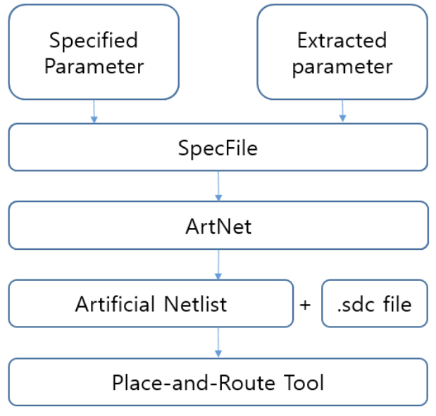

# Experiments

This directory contains scripts for ArtNet evaluation flows, as described in the chart below.

|  |
|:--:|

## Spec File Generation

ArtNet enables netlist generation from (1) parameters of a given target design and (2) user-specified parameters

1. Spec file generation from target design
  - ASAP7 nova is used for example run
  - User can set sub-module hierarchy depth using 'hierarchy_level' in ./SpecGen_fromDesign/ref_scripts/extract_spec_asap7.tcl
```bash
cd SpecGen_fromDesign
python3 extract_spec.py
```

2. Spec file generation from user-specified parameters
  - Example run script: ./SpecGen_fromUserInputs/run_specgen.tcl
```bash
cd SpecGen_fromUserInputs
./openroad run_specgen.tcl
```

## ArtNet Netlist Generation from Spec File

Example script for ArtNet netlist is in ./NetlistGen_fromSpec
  - Input file: ArtNet.spec
  - Output file: ArtNet.v
```bash
cd NetlistGen_fromSpec
./openroad run_artnetgen.tcl
```

## Scripts for ArtNet Evaluation

1. P&R scripts: **Innovus_scripts**
  - Power distribution network (PDN) and report generation scripts
  - Place and route scripts for logic-only (run_invs.tcl) and with-macro designs (run_invs_ariane.tcl)

2. Assessment scripts: **Assessment**
- CellType: script for cell type similarity measurement
- Locality: scripts for design locality evaluation
  - Clustering: Leiden clustering script, graph generation script, and nova design data (real, ArtNet flat, ArtNet hier)
  - Routing_congestion_map: layer-wise congestion extraction and plot scripts
  - Timing-critical_path: Innovus script for highlighting timing critical paths (top 1000 paths)
  - IR_drop: Voltus script for static IR-drop measurement
- PnREval: ArtNet netlist generation scripts for five designs and P&R run submission script
  - Ariane-133
  - JPEG encoder
  - Netcard
  - Tate_pairing
  - NOVA

3. Mini-brain evaluation: **Mini-brain**
- netlists: mini-brain netlists for the five designs
- DTCO_ranks: Tech LEF / QRC files for various technologies and ranking script

4. Other evaluations
  - **Convergence**: scripts for design parameter convergence test
  - **Coverage**: scripts for design parameter coverage test
  - **Efficiency**: script for runtime measurement (initialization, hierarchical clustering, and circuit generation)
  - **CNN-DRV**: script for CNN-based DRV prediction performance comparison

# EDA Vendor Permissions
Thanks to permissions from the major EDA companies, we can share our research scripts in GitHub for use by other researchers, as long as the proper header is given. Please see the required header language, below.

## Cadence
  
	This script was written and developed by ABKGroup students at UCSD. 		
	However, the underlying commands and reports are copyrighted by Cadence.
	We thank Cadence for granting permission to share our research to help 
	promote and foster the next generation of innovators. 

