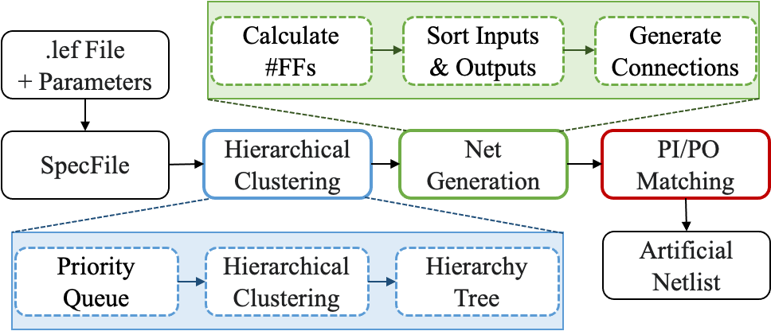

# ArtNet

This repository contains all the codes and scripts for our paper.  



We provide the following:
1. C++ codes for the ArtNet (./OpenRoad/src/ang/src)
2. Scripts for Runtime Efficiency Check (./Experiments/Efficiency)
3. Scripts for Convergence Experiment (./Experiments/Convergence)
4. Scripts for Coverage Experiment (./Experiments/Coverage)
4. Scripts for Spec File Generation (./Experiments/{SpecGen_fromDesign, SpecGen_fromUserInputs})
5. Scripts for Dataset Analysis (./Experiments/CNN-DRV) (DRV model is not included. Please refer to ref[24] in the paper.)
6. Scripts and Results (.v file) for P&R Assessment (./Experiments/Assessment)
7. Scripts, Tech files and Results (.v file) for Mini-brains (./Experiments/Mini-brain)
8. Updated Lef/Def parser for RentCon (from v5.7 to v5.8) (./Experiments/RentCon)

How to build OpenROAD
```bash
cd OpenROAD
mkdir build
cd build
cmake ..
make -j ${num_threads}
```

How to build RentCon
1. Original RentCon Link: (https://vlsicad.ucsd.edu/WLD/index.html)
2. Dependency update: the required compiler has been updated from g++ 3.2.3 or higher to gcc 9.3.0 or higher
```bash
cd Experiments/RentCon/Source
./configure
make -f makefile.install
```
- Details are provided in the RenCon README.
- Please note that we only modified files in "RentCon/Source/Lef" and "RentCon/Source/Def":
  - These are the Si2 LEF/DEF parsers from 2020, obtained from [The OpenROAD Project Attic](https://github.com/The-OpenROAD-Project-Attic/) GitHub organization repositories, linked [here (LEF)](https://github.com/The-OpenROAD-Project-Attic/lef) and [here (DEF)](https://github.com/The-OpenROAD-Project-Attic/def)

How to run
- ArtNet run and evaluation scripts and details are in [Experiments](./Experiments)

## Current directory structure 

```
.
├── Experiments
│   ├── Assessment
│   │   ├── CellType
│   │   ├── Locality
│   │   └── PnREval
│   ├── CNN-DRV
│   │   └── analyze.py
│   ├── Convergence
│   │   ├── ref_artnet.tcl
│   │   ├── ref_asap7.aux
│   │   ├── ref_or_place.tcl
│   │   ├── ref.sdc
│   │   ├── run_artnet.tcl
│   │   └── run.py
│   ├── Coverage
│   │   ├── ref_artnet.tcl
│   │   ├── ref.sdc
│   │   └── run.py
│   ├── Efficiency
│   │   ├── ref_artnet.tcl
│   │   ├── run.py
│   │   └── summary.py
│   ├── Innovus_scripts
│   │   ├── pdn
│   │   ├── run_invs_ariane.tcl
│   │   ├── run_invs.tcl
│   │   └── util
│   ├── Mini-brain
│   │   ├── DTCO_ranks
│   │   └── netlists
│   ├── NetlistGen_fromSpec
│   │   ├── ArtNet.spec
│   │   └── run_artnetgen.tcl
│   ├── pdk
│   │   ├── lef
│   │   ├── lib
│   │   └── qrc
│   ├── README.md
│   ├── RentCon
│   │   ├── DOC
│   │   └── Source
│   ├── SpecGen_fromDesign
│   │   ├── extract_spec.py
│   │   ├── ref_netlists
│   │   ├── ref_scripts
│   │   ├── RentParam.txt
│   │   └── utils
│   └── SpecGen_fromUserInputs
│       └── run_specgen.tcl

├── OpenROAD
    └── src
      └── ang
          ├──include
          │     └── ang          
          │         ├── MakeArtNetGen.h
          │         └── artNetGen.h
          └── src
              ├── CMakeLists.txt
              ├── MakeArtNetGen.cpp
              ├── artNetGen.cpp
              ├── artNetGen.i
              ├── artNetGen.tcl
              ├── block.cpp
              ├── cell.cpp
              ├── cell.h
              ├── circuit.h
              ├── delay_level.cpp
              ├── delay_level.h
              ├── distribution.cpp
              ├── extract.cpp
              ├── helper.cpp
              ├── masterInfo.cpp
              ├── masterInfo.h
              ├── cluster.cpp
              ├── utilities.cpp
              ├── utilities.h
              └── spec.cpp
```
## Run Version Information
**[Open-Source]**
- **OpenROAD** : https://github.com/The-OpenROAD-Project/OpenROAD 
  - Commit Version: [c7d97cc3dc9373310f6ebb46013d9c41be8a87e8]

For commercial EDA tools, we tested the tools with the versions below.

**[Cadence]**
- **Genus** : 21.1
- **Innovus** : 21.1
- **Quantus** : 21.1
- **Voltus** : 18.1

## License

BSD 3-Clause License. See [LICENSE](./LICENSE) file.
